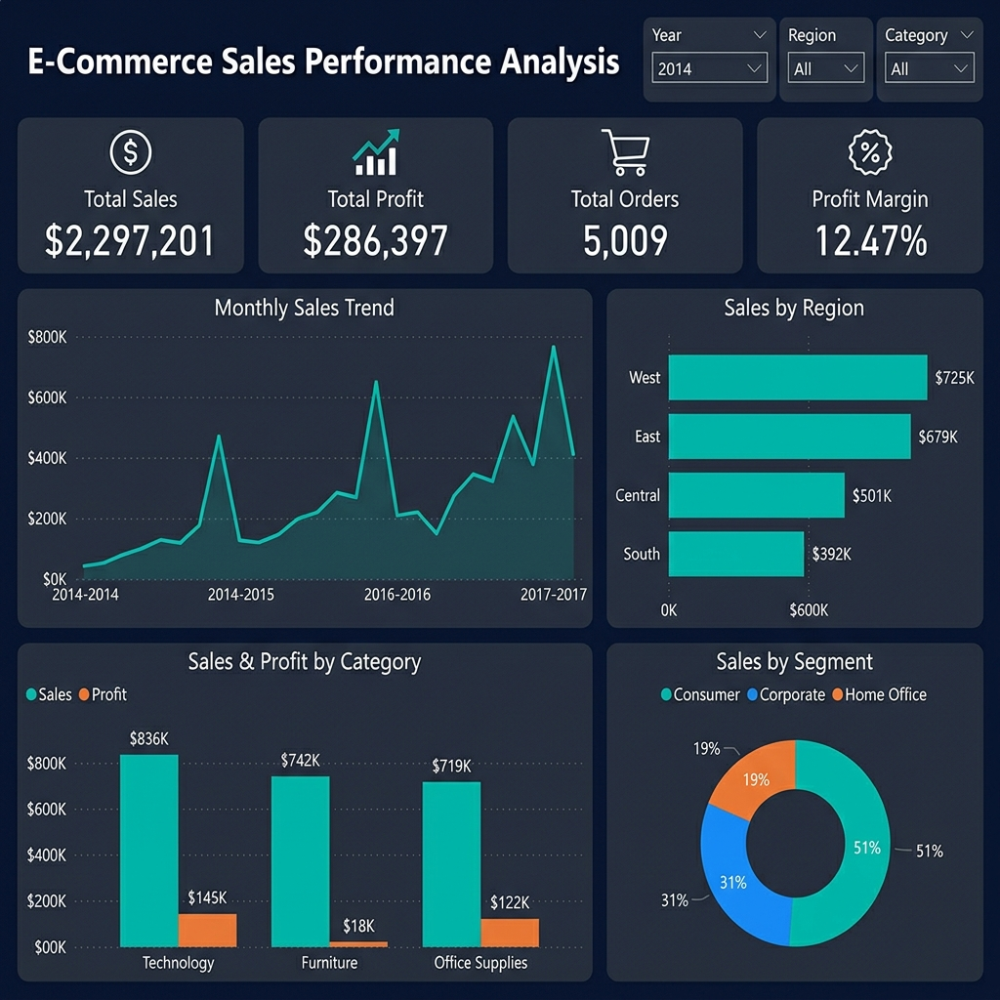

# E-Commerce Sales Performance Analysis

End-to-end sales analytics project: cleaning raw retail transaction data in Excel, analyzing it with 27 SQL queries in SQLite, and visualizing results in an interactive Power BI dashboard to answer real business questions about revenue, profitability, and customer value.



## Business Problem

An online retailer wants to understand:
- Which products generate the most revenue?
- Which regions are most profitable?
- Which customer segments should receive more marketing investment?
- How do sales change over time?

## Dataset

[Superstore Sales](https://www.kaggle.com/datasets/vivek468/superstore-dataset-final) dataset (public retail sales dataset, ~10K orders) with order-level fields: Order ID, Order/Ship Date, Customer, Segment, Region, City/State, Category, Sub-Category, Product Name, Sales, Quantity, Discount, and Profit.

## Tools & Skills Used

| Stage | Tool | Skill Demonstrated |
|---|---|---|
| Data Cleaning | Excel | Deduplication, handling nulls, data type correction, standardization |
| Analysis | SQL (SQLite) | Aggregation, window functions, CASE logic, CTEs, subqueries |
| Visualization | Power BI | KPI cards, trend charts, slicers, interactive dashboards |
| Reporting | Written report | Translating data into business recommendations |

## Key Metrics at a Glance

| Metric | Value |
|---|---|
| Total Sales | $2,297,201 |
| Total Profit | $286,397 |
| Total Orders | 5,009 |
| Profit Margin | 12.47% |
| Avg Order Value | $458.61 |

## Project Workflow

### 1. Data Cleaning (`/Excel`)
- Removed duplicate order rows
- Handled missing values in `Postal Code` and `Customer Name` fields
- Standardized date formats (Order Date / Ship Date → `YYYY-MM-DD`)
- Corrected data types (Sales/Profit → numeric, Discount → percentage)
- Standardized category and sub-category naming conventions
- Saved as `Cleaned_Data.xlsx` with formatted headers, currency, and percentage columns

### 2. SQL Analysis (`/SQL/analysis.sql`)
27 queries across 6 sections, all written in **SQLite** syntax:

| Section | Queries | Key Findings |
|---|---|---|
| High-Level KPIs | 1–5 | $2.3M sales, $286K profit, 12.47% margin |
| Time Trends | 6–10 | Nov-Dec peak; 2017 grew 20.36% YoY |
| Product Performance | 11–17 | Canon imageCLASS #1 ($61.6K); 302 loss-making products |
| Geographic Performance | 18–21 | West leads profit ($108K); 10 states lose money |
| Customer Analysis | 22–24 | 98.5% are repeat buyers; Consumer segment = highest volume |
| Discount & Pricing | 25–27 | Margin turns negative above 20% discount; 1,871 loss-making discounted orders |

### 3. Power BI Dashboard (`/PowerBI`)
- **Page 1 — Overview**: KPI cards, monthly sales trend, sales by region, sales & profit by category, segment donut chart
- **Page 2 — Product & Discount Analysis**: Top 10 products, discount impact on margin, sub-category treemap, YoY growth
- Interactive slicers: Year, Region, Category

Screenshots in `/Dashboard_Screenshots`.

### 4. Business Insights
- The **West region** contributes the highest profit margin (14.94%), while the **Central region** underperforms at 7.92% despite $501K in sales.
- **Technology** products generate the highest profit ($145K, 17.4% margin), while **Furniture** barely breaks even ($18K, 2.49% margin).
- Orders with discounts **above 20%** show sharply negative margins (-11.55% at 21-30%, -91.47% at 30%+). **1,871 orders** were sold at a loss due to discounting.
- Sales peak in **November ($352K) and December ($325K)**, consistent with holiday shopping seasonality.
- **98.5% of customers** are repeat buyers, and the **top 10 customers** account for significant revenue (Sean Miller: $25K, Tamara Chand: $19K).
- **10 states** are unprofitable, led by Texas (-$25.7K), Ohio (-$17K), and Pennsylvania (-$15.6K).

### 5. Recommendations
1. **Reallocate marketing spend** toward the West and East regions and reduce investment in the Central region until fulfillment costs are addressed.
2. **Cap discounts at 20%** — or restructure discount structures — on sub-categories that become unprofitable past this threshold.
3. **Prioritize Technology** category in inventory planning and promotions for maximum profit per order.
4. **Investigate Furniture** profitability: the -5.77% average per-order margin suggests systemic cost/pricing issues.
5. **Build a loyalty program** targeted at top-spending repeat customers to increase their lifetime value.
6. **Plan inventory and staffing** for the November-December seasonal peak.
7. **Exit or re-price** in consistently loss-making states (Texas, Ohio, Pennsylvania).

## Repository Structure

```
Ecommerce-Sales-Analysis/
│
├── Dataset/                    # Raw source data (Superstore CSV)
├── Excel/
│   └── Cleaned_Data.xlsx       # Cleaned & formatted dataset
├── SQL/
│   └── analysis.sql            # 27 SQLite queries with results
├── PowerBI/
│   ├── Dashboard.pbix          # Interactive dashboard file
│   └── Dashboard_Build_Guide.md
├── Dashboard_Screenshots/      # PNGs of dashboard views
├── Report/
│   └── Business_Report.docx    # Written insights & recommendations
└── README.md
```

## How to Reproduce

1. **Clone** this repository
2. **Excel**: Open `Dataset/Sample - Superstore.csv` → clean per the steps above → or use `Excel/Cleaned_Data.xlsx` directly
3. **SQL**: Import `Cleaned_Data.xlsx` into SQLite → run `SQL/analysis.sql`
4. **Power BI**: Open Power BI Desktop → Get Data → Excel → select `Cleaned_Data.xlsx` → follow `PowerBI/Dashboard_Build_Guide.md`

## Key Takeaway

This project follows the full analytics lifecycle — **Ask → Prepare → Process → Analyze → Share → Act** — turning raw transactional data into decisions a retail business could actually act on.

---
**Author:** Bhaskar Danu · Data Analyst · [LinkedIn](https://www.linkedin.com/in/bhaskar-danu-194a42425) · [GitHub](https://github.com/bhaskar08-GTK)
